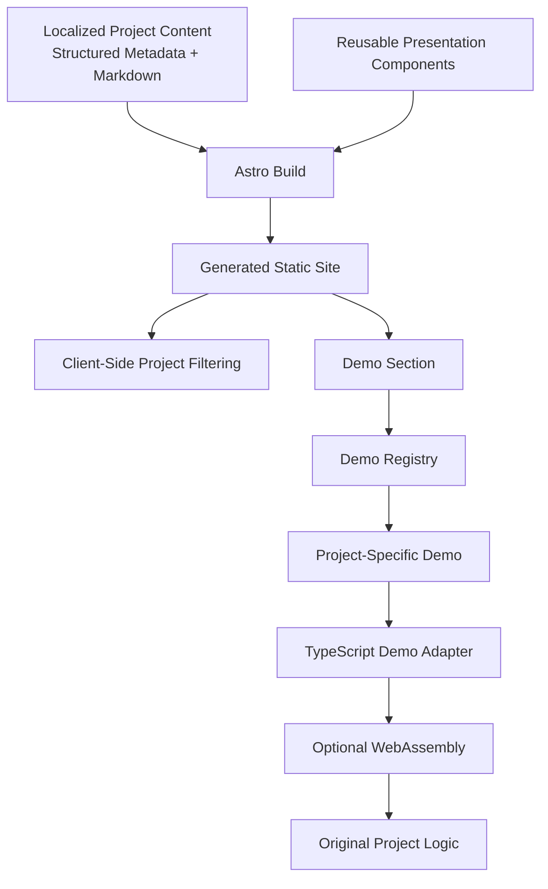
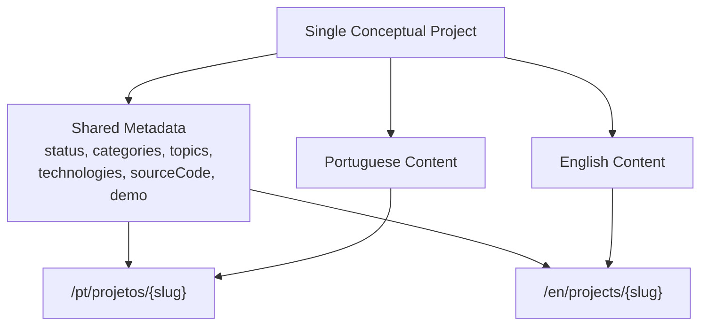
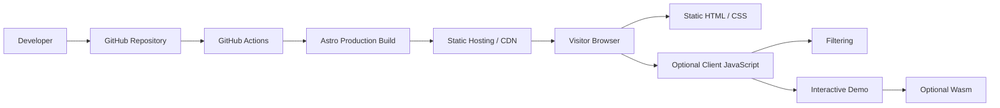

# Portfolio Website — Architecture

## 1. Purpose

This document describes the initial software architecture of the portfolio website.

The architecture is intended to support the current V1 requirements while keeping the application simple, maintainable, and extensible.

The main architectural goals are:

- generate the majority of the website as static content;
- represent projects through reusable, content-driven pages;
- support optional interactive project demonstrations;
- allow compatible C projects to execute in the browser through WebAssembly;
- isolate interactive functionality so failures do not break the rest of the website;
- support client-side project filtering without introducing a backend;
- provide Portuguese content initially while allowing a complete English version later;
- keep project content separate from presentation and implementation details;
- avoid infrastructure that is not required by the current product requirements.

This architecture intentionally does **not** introduce a backend API, database, authentication system, CMS, or application server.

---

# 2. Architecture Drivers

The main requirements influencing the architecture are:

1. The portfolio is primarily a content-oriented website.
2. Project pages must be reusable rather than manually implemented for each project.
3. Adding a normal project should mostly involve adding project content.
4. Projects may contain substantial technical explanations.
5. Some projects should support interactive browser demonstrations.
6. Interactive demonstrations are optional and project-specific.
7. C projects such as `my_mouse` may execute through WebAssembly.
8. The website must remain useful if a demo fails to load or execute.
9. Project filtering must operate without a backend.
10. The site must initially support Portuguese and be architecturally prepared for English.
11. The production website should be statically generated.
12. Development and deployment should use a GitHub-based workflow with automated validation.

These requirements lead to a **static-first architecture with isolated client-side interactive features**.

---

# 3. High-Level Architecture

The system is divided conceptually into the following responsibilities:

```text
Content
   ↓
Content Processing / Astro Build
   ↓
Reusable Presentation
   ↓
Static Site
   ↓
Browser

Optional browser functionality:
├── Project filtering
└── Interactive project demos
```

The primary dependency direction is:

```text
Project Content
      ↓
Astro Build
      ↓
Reusable Components
      ↓
Generated Pages
```

Interactive functionality is added on top of the generated static site rather than forming the foundation of the application.

This allows the portfolio to remain functional even if JavaScript or a project demo fails.

---

# 4. Technology Responsibilities

## 4.1 Astro

Astro is the website framework.

Its primary responsibilities are:

- reading portfolio and project content;
- validating structured project metadata;
- generating routes;
- composing reusable UI components;
- rendering project pages;
- producing static HTML, CSS, JavaScript, and other assets.

Astro is used primarily as a **build-time framework**.

The majority of portfolio content should not require client-side JavaScript to render.

---

## 4.2 TypeScript

TypeScript is the primary application language.

It is used for:

- application logic;
- content-related types and validation where appropriate;
- interactive browser functionality;
- project filtering;
- demo integration;
- WebAssembly adapters;
- reusable application components where scripting is required.

---

## 4.3 Bun

Bun is the development and build toolchain.

Its responsibilities include:

- dependency installation;
- running project scripts;
- running the local Astro development environment;
- running checks and tests;
- executing the production build.

Bun is **not a production server requirement**.

The deployed V1 application consists of static assets and therefore does not require a Bun process running in production.

---

# 5. Project Content Architecture

Project content follows a **hybrid structured-content model**.

Different kinds of information are stored differently based on how the application uses them.

## 5.1 Structured metadata

Information that the application must interpret programmatically remains strongly structured.

Examples include:

- project identity;
- slug;
- status;
- categories;
- origin;
- topics;
- technologies;
- technical decisions;
- challenges;
- lessons learned;
- source-code availability;
- interactive-demo configuration.

Structured metadata is particularly important for:

- validation;
- project filtering;
- conditional rendering;
- routing;
- demo selection.

For example, the application should be able to determine directly that:

```text
categories:
- algorithms
- systems
```

or that:

```text
demo:
  availability: interactive
  id: my-mouse
```

without analyzing prose.

---

## 5.2 Long-form technical content

Long explanations should use a Markdown-friendly representation.

Typical examples include:

- project description;
- technical overview;
- architecture explanation;
- algorithm explanation;
- testing strategy.

Markdown is better suited to these sections because technical explanations may contain:

- multiple paragraphs;
- headings;
- lists;
- code examples;
- links;
- diagrams.

The conceptual content model remains valid even when the physical representation uses Markdown.

For example, `algorithm` remains a meaningful project concept even if its explanation is authored using Markdown rather than stored as a single primitive data property.

---

## 5.3 Algorithm complexity

Formal complexity information belongs inside the algorithm section rather than being a top-level project property.

Conceptually:

```text
algorithm
├── explanation
└── complexity?
    ├── time?
    ├── space?
    └── explanation?
```

Projects without a meaningful algorithm analysis therefore do not need a separate complexity section.

---

# 6. Project Identity and Localization

A project represents **one conceptual project**, regardless of language.

The system should not treat the Portuguese and English representations of the same project as unrelated projects.

Conceptually:

```text
Project
│
├── Shared metadata
│   ├── status
│   ├── categories
│   ├── origin
│   ├── topics
│   ├── technologies
│   ├── sourceCode
│   └── demo
│
├── Portuguese content
│
└── English content
```

Shared technical facts should not need to be duplicated between languages.

For example:

```text
status
technologies
sourceCode.url
demo.availability
```

describe the project itself rather than a particular translation.

Localized content contains human-readable text such as:

- title where translation is appropriate;
- summary;
- description;
- technical explanations;
- testing explanation;
- other narrative content.

The exact Astro representation of this model is intentionally deferred until content-system implementation.

---

# 7. Localization and Routing

The routing model uses explicit locale prefixes.

Portuguese routes:

```text
/pt/
/pt/projetos
/pt/projetos/my-mouse
```

Future English routes:

```text
/en/
/en/projects
/en/projects/my-mouse
```

The project identity remains stable across languages.

For example:

```text
my-mouse
```

represents the same project in:

```text
/pt/projetos/my-mouse
/en/projects/my-mouse
```

## 7.1 Root behavior

For V1:

```text
/
↓
/pt/
```

The root route should redirect to Portuguese because Portuguese is the only fully implemented site language initially.

Future browser-language detection may redirect visitors automatically to `/pt/` or `/en/`, but this behavior is explicitly deferred and is not required for V1.

Once English exists, the interface should also provide an explicit language switch.

---

# 8. Reusable Project Pages

Individual projects should not have separately implemented page architectures such as:

```text
MousePage
BsqPage
MastermindPage
EmployeeManagementPage
```

Instead:

```text
Project Content
      ↓
Reusable Project Page
```

The reusable page renders the project based on the available content.

Conceptually, it may contain sections such as:

```text
ProjectPage
├── Overview
├── Metadata
├── Demo
├── Technical Content
├── Technical Decisions
├── Challenges
├── Testing
├── Lessons Learned
└── Source Code
```

Sections are rendered only when relevant.

The project page must not contain project-specific branches such as:

```text
if project == my_mouse
```

Project-specific behavior belongs behind explicit extension boundaries such as the demo registry.

---

# 9. Presentation Layer

Reusable presentation components are responsible for turning project content into UI.

Examples include conceptual components such as:

- site layout;
- navigation;
- project cards;
- project listing;
- project metadata;
- technical sections;
- source-code information;
- demo section;
- CV section;
- contact section.

Presentation components consume project data but do not own project content.

For example, a project card may receive:

```text
title
summary
status
categories
technologies
slug
```

but the card itself should not define those values.

---

# 10. Client-Side Project Filtering

Project filtering is implemented entirely in the browser.

All project information already exists at build time, so filtering does not require:

- an API;
- a backend server;
- a database;
- additional HTTP requests for project data.

The flow is:

```text
Project Content
      ↓
Astro Build
      ↓
Generated Project Listing
      ↓
Browser
      ↓
Filtering Logic
```

Filtering may use structured metadata including:

- categories;
- origin;
- topics;
- potentially technologies.

Categories and origin are expected to provide the main visible filtering controls.

Topics may eventually support more detailed filtering or search without requiring every possible topic to become a permanent UI button.

---

# 11. Interactive Demo Architecture

Interactive demos are a separate capability from normal project rendering.

Every project contains an explicit demo state.

Examples include:

```text
interactive
planned
unavailable
```

A project without a meaningful browser interaction therefore still communicates its demo state explicitly.

Example:

```text
demo:
  availability: unavailable
```

may result in explanatory static content rather than an empty section.

---

# 12. Demo Registry

Interactive projects use a **demo registry**.

Project content identifies the demo using a stable identifier.

Conceptually:

```text
demo:
  availability: interactive
  id: my-mouse
```

Application code then maps the identifier to its implementation:

```text
Demo Registry

my-mouse      → MyMouseDemo
my-bsq        → BsqDemo
mastermind    → MastermindDemo
```

This prevents the generic project page from knowing how individual demos work.

The dependency becomes:

```text
Project Page
    ↓
Demo Section
    ↓
Demo ID
    ↓
Demo Registry
    ↓
Project-Specific Demo
```

The content defines **which capability exists**.

Application code defines **how the capability is implemented**.

---

# 13. Demo Internal Architecture

Interactive demos may contain up to three conceptual layers:

```text
Demo UI
   ↓
Demo Adapter
   ↓
Original Project Logic
```

For C projects using WebAssembly:

```text
Browser UI
    ↓
TypeScript Adapter
    ↓
WebAssembly Interface
    ↓
Compiled C Logic
```

## 13.1 Demo UI

Responsible for:

- user input;
- controls;
- visual output;
- loading states;
- interaction errors;
- reset or retry behavior.

It should not contain the project's core algorithm merely because the project is being displayed in a browser.

---

## 13.2 Demo adapter

The adapter forms the boundary between the portfolio UI and the original project implementation.

Its responsibilities may include:

- converting browser input into the representation expected by the project;
- invoking WebAssembly functions;
- converting project output into a UI-friendly representation;
- handling integration errors.

This keeps browser-specific concerns separate from the original project logic.

---

## 13.3 Original project logic

Whenever practical, the original implementation should remain the source of the project's actual behavior.

For example:

```text
my_mouse

Browser maze editor
      ↓
TypeScript adapter
      ↓
WebAssembly
      ↓
original C maze-solving logic
```

The goal is to demonstrate the original project rather than rewriting the algorithm in frontend code.

---

# 14. WebAssembly Boundary

WebAssembly is considered an implementation detail of compatible interactive demos rather than a global portfolio subsystem.

Conceptually:

```text
Portfolio
├── Content
├── Presentation
└── Demos
     ├── my_mouse
     │   ├── UI
     │   ├── adapter
     │   └── Wasm
     │
     └── my_bsq
         ├── UI
         ├── adapter
         └── Wasm
```

Projects without WebAssembly are unaffected by this architecture.

The exact process for generating `.wasm` artifacts is intentionally deferred.

Potential strategies include:

1. compiling manually and committing the generated artifact;
2. generating the artifact through the build or CI pipeline.

The choice should be made when the first WebAssembly demo is implemented and the real Emscripten requirements are understood.

---

# 15. Progressive Enhancement and Failure Isolation

Static portfolio content must not depend on optional interactive features.

The dependency direction is:

```text
Static Project Page
       │
       └── Optional Interactive Demo
```

not:

```text
Interactive Demo
       ↓
Project Page
```

If client-side JavaScript fails, visitors should still be able to access:

- the home page;
- project listings;
- project pages;
- descriptions;
- technical explanations;
- contact information;
- CV links;
- source-code information.

Interactive features may become unavailable, including:

- filtering;
- demos;
- WebAssembly execution.

If only one demo fails, the failure should remain isolated to that demo.

Example:

```text
my_mouse project page

✓ title
✓ summary
✓ algorithm explanation
✓ challenges
✓ technical decisions
✓ repository information

✗ interactive demo failed to initialize
```

The rest of the page should remain fully usable.

---

# 16. Static Assets

Static assets are separate from project content.

Examples include:

- Portuguese CV PDF;
- English CV PDF;
- icons;
- future images;
- compiled WebAssembly binaries;
- other generated demo artifacts.

Content may reference these assets, but the assets themselves are not part of the conceptual project-content model.

For example:

```text
Demo implementation
      ↓
uses
      ↓
my_mouse.wasm
```

The `.wasm` file belongs to the demo implementation boundary.

---

# 17. Build-Time and Browser Runtime Responsibilities

A clear distinction should exist between build-time work and browser runtime work.

## Build time

Astro is responsible for:

- loading project content;
- validating metadata;
- resolving routes;
- rendering static pages;
- composing reusable components;
- producing deployable static assets.

Conceptually:

```text
Repository Content
      ↓
Astro Build
      ↓
Static Output
```

---

## Browser runtime

Browser execution should be limited to functionality that actually requires interaction.

Current examples:

```text
Browser Runtime
├── project filtering
└── interactive demos
```

Normal project content should not require JavaScript to appear.

---

# 18. CI Architecture

GitHub Actions is the selected CI system.

CI stands for **Continuous Integration**.

Its role is to automatically validate repository changes before they are integrated into the main branch.

A Pull Request should eventually trigger checks conceptually similar to:

```text
Pull Request
    ↓
GitHub Actions
    ↓
Install dependencies
    ↓
Validation / type checks
    ↓
Tests
    ↓
Production build
    ↓
Pass / Fail
```

The exact set of checks will evolve as the application gains functionality.

The architectural principle is:

> Changes should be automatically validated before being merged into `main`.

---

# 19. Deployment Architecture

The production application is statically deployed.

Conceptually:

```text
Developer
    ↓
Git / GitHub
    ↓
Pull Request
    ↓
GitHub Actions
    ↓
Merge to main
    ↓
Production Build
    ↓
Static Hosting / CDN
    ↓
Browser
```

The production environment serves static assets including:

- HTML;
- CSS;
- JavaScript;
- PDFs;
- WebAssembly;
- other static files.

There is no production dependency on:

- Bun runtime server;
- Node.js server;
- backend API;
- database;
- Redis;
- authentication service.

---

# 20. Hosting

The exact hosting provider is intentionally deferred.

Possible providers include platforms such as:

- Cloudflare Pages;
- Vercel;
- another appropriate static hosting/CDN provider.

The architecture only requires the hosting platform to support:

- static site hosting;
- HTTPS;
- custom domains;
- GitHub-based deployment;
- static asset delivery;
- CDN behavior appropriate for a portfolio website.

Choosing the provider should not require redesigning the application.

---

# 21. Application Architecture Diagram



The WebAssembly and original-project-logic nodes are optional and apply only to compatible demos.

---

# 22. Localization and Content Flow



For V1, Portuguese content is required while complete English content may be added later.

---

# 23. Runtime and Deployment Diagram



---

# 24. Architectural Boundaries Summary

The main responsibilities are:

| Boundary | Responsibility |
|---|---|
| Project content | Describes projects and their technical information |
| Localization | Provides human-readable content for each supported language |
| Astro/build layer | Validates content and generates static pages |
| Presentation | Renders reusable site and project UI |
| Client interaction | Provides filtering and other browser-only behavior |
| Demo registry | Connects project demo identifiers to implementations |
| Demo UI | Handles user interaction for a specific project |
| Demo adapter | Integrates browser behavior with original project logic |
| WebAssembly | Executes compatible compiled project logic |
| CI | Validates changes before integration |
| Static hosting | Serves generated production assets |

These boundaries should remain conceptually separate even if implementation details later place related code close together.

---

# 25. Deferred Decisions

The following decisions are intentionally postponed because current requirements do not justify fixing them yet.

## Hosting provider

Cloudflare Pages, Vercel, or another static hosting provider may be selected later.

## WebAssembly compilation strategy

The project may either:

- commit ready-to-use Wasm artifacts;
- or generate them during CI/build.

This should be evaluated while implementing the first real WebAssembly demo.

## Browser-language detection

V1 redirects:

```text
/ → /pt/
```

Automatic language detection may later choose between Portuguese and English once both versions are complete.

## Exact Astro content representation

The conceptual hybrid content architecture is established, but the exact Astro Content Collection or TypeScript schema design should be decided during content-system implementation.

## Exact repository folder structure

This document defines system responsibilities and boundaries rather than prematurely prescribing the final directory layout.

The repository structure should be derived from these boundaries during application initialization.

---

# 26. Architectural Principles

The following principles should guide future development.

### Static first

Prefer build-time generation and static delivery unless a requirement genuinely needs runtime infrastructure.

### Content-driven projects

Normal projects should be added mainly through project content rather than custom page implementations.

### Reusable presentation

Generic components should not contain project-specific behavior.

### Explicit extension points

Project-specific interactive behavior should connect through defined boundaries such as the demo registry.

### Progressive enhancement

Interactive JavaScript should improve the portfolio without being necessary for the core content to function.

### Failure isolation

A failed demo must not break its project page or the rest of the site.

### Separation of concerns

Keep conceptually separate:

- content;
- localization;
- presentation;
- client-side interaction;
- demo integration;
- original project logic;
- generated assets.

### Avoid speculative complexity

Do not introduce backends, databases, runtime servers, abstraction layers, or deployment infrastructure without an actual requirement.

### Preserve project authenticity

Where practical, interactive demonstrations should execute or integrate with the original project implementation instead of replacing it with a simplified frontend rewrite.

---

# 27. Current Architecture Status

The initial V1 architecture is sufficiently defined to begin creating implementation tasks once the accompanying architecture decisions are recorded.

The next design/documentation activities are:

1. review this architecture document;
2. create Architecture Decision Records for major technical decisions;
3. define the initial implementation backlog and milestones;
4. initialize the Astro application only after the documentation phase is complete.

Important decisions deserving initial ADRs include:

- using Astro as the website framework;
- using Bun as the development/build toolchain;
- using WebAssembly for compatible interactive C project demonstrations.

Implementation should follow the architecture described here.

If implementation later reveals a constraint that conflicts with this architecture, the implementation should not silently redefine the design.

Instead:

```text
Implementation discovers constraint
        ↓
Architecture discussion
        ↓
Decision
        ↓
Update architecture / ADR
        ↓
Continue implementation
```